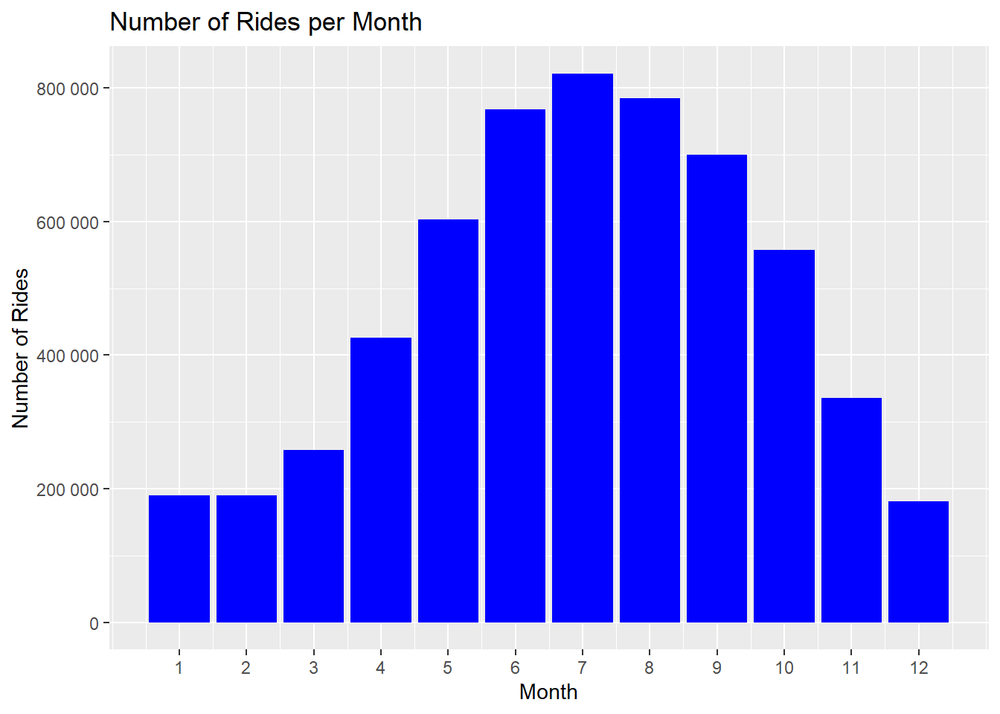
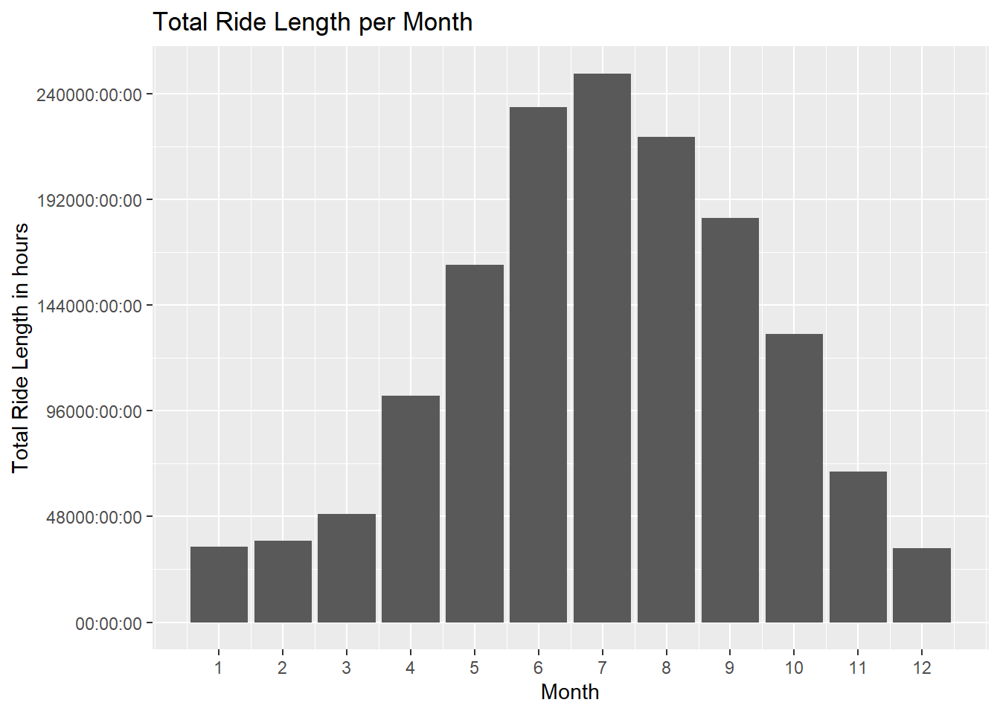
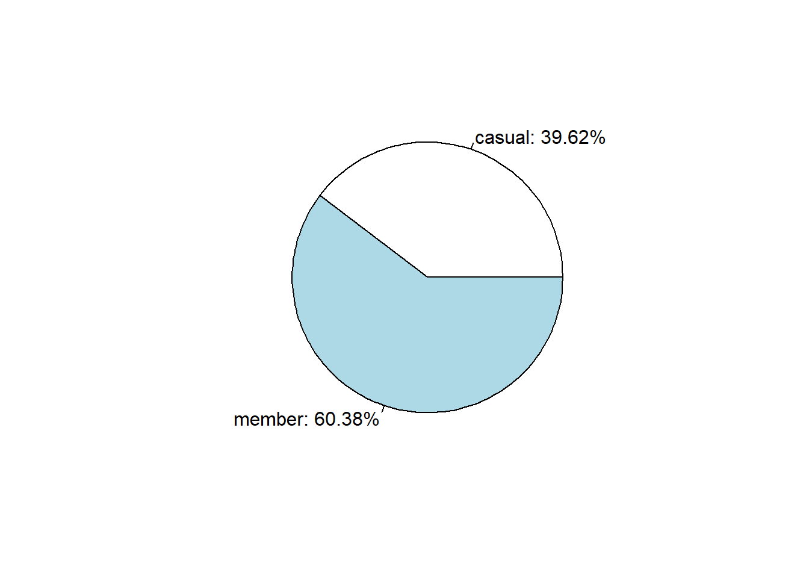
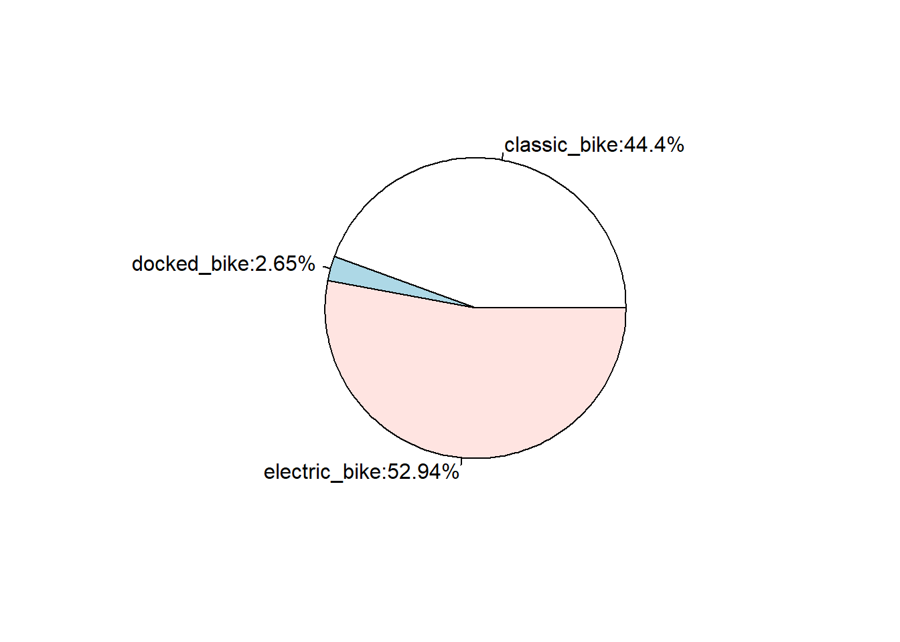
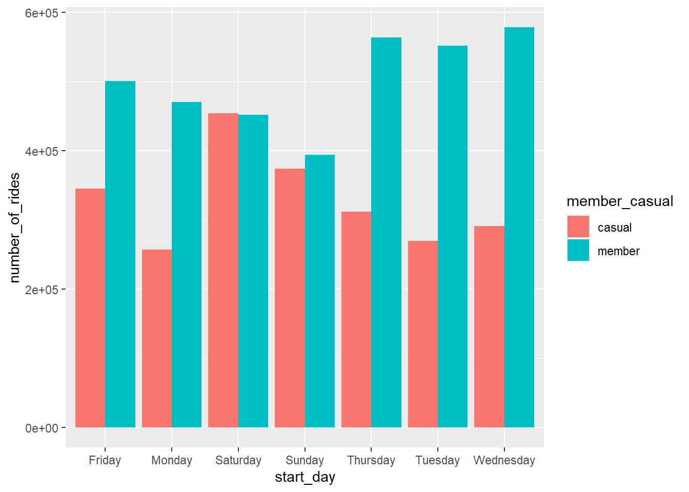
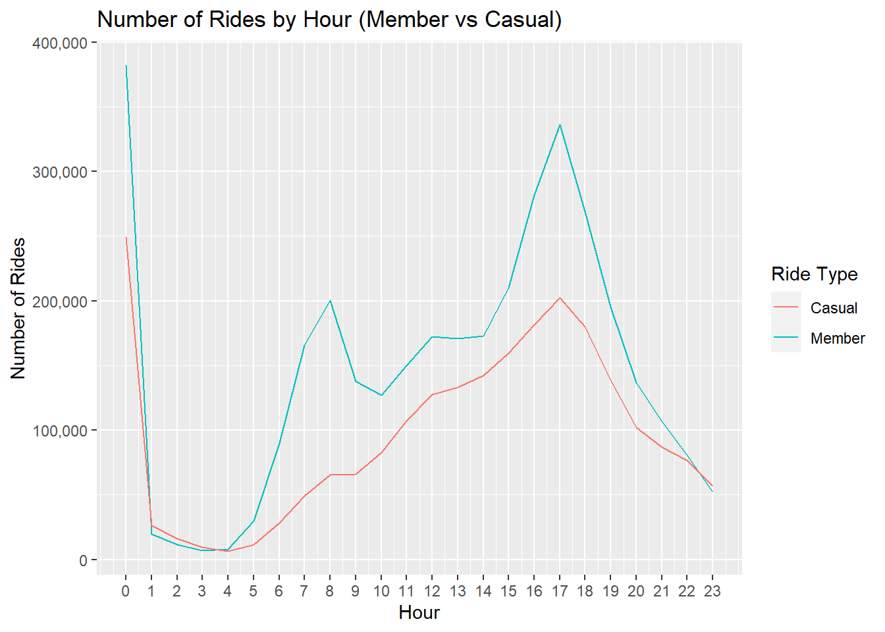
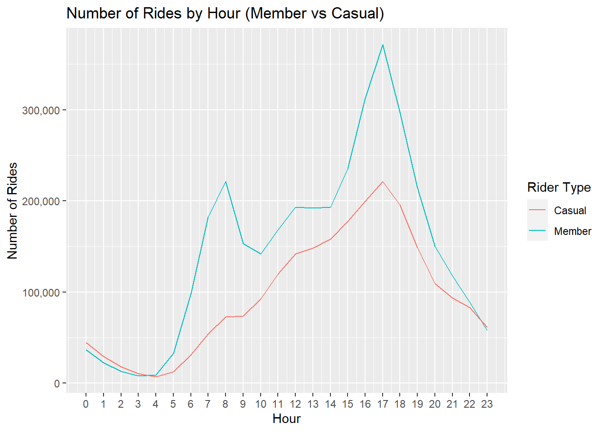
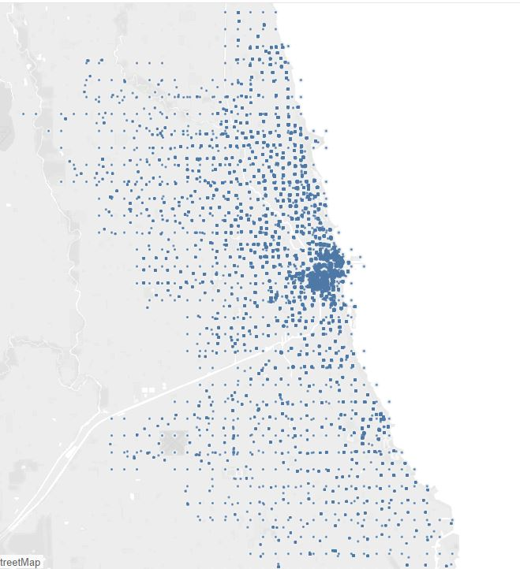
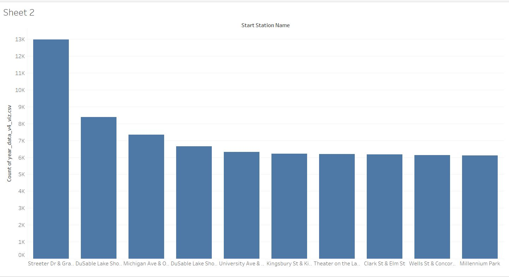

# capstone_project
Scenario 
Hello, I am a junior data analyst working in the marketing analyst team at Cyclistic, a bike-share company in Chicago. The director of marketing believes the company’s future success depends on maximizing the number of annual memberships. Therefore, my team wants to understand how casual riders and annual members use Cyclistic bikes differently. From these insights, they  will design a new marketing strategy to convert casual riders into annual members. But first, Cyclistic executives must approve my recommendations, so they must be backed up with compelling data insights and professional data visualizations.

ASK
The director of marketing and your manager Mr Moreno has a clear goals: to analyse how member and casual riders ride differently, what make casual riders register in membership, and how can we use media to approach that goal

Prepare

I used Cyclistic’s historical trip data to get the data from , they were in form of CSV files, 12 files representing the data taken from 12 months (from June 2022 to May 2023) 
after I took snap look to the dataset, I think the data is ROCCC

- Reliable: it is trusted data, it has hundreds of thousands on rides in each month , it is structured that has same columns or description on data
- Original because we know its source and it has license on it

- comprehensive, they have no missing information (not mean that it is clean)
-Current: the data set is from June 2022 to May 2022 and started the analysis in June 2023
- it is also cited 

I created a new folder to store these 12 tables of dataset and made sure they all have same format of naming (one month had different name format I edited its name) 


Process 

I opened each CSV file, I changed it to XLS format 

I changed the data type of two columns :
started_at and ended_at to DATE TIME format: dd-mm-yyyy hh:mm 

Then I created new column and named it: ride_length and it is the sub between: ended_at and started_at and then I changed the date form for the whole column to datetime hh:mm:ss

I als creatd new column:
 week_day and used function weekday to extract the day name from the start_at column 
after 

then I saved it back as CSV  format
I couldn’t make any further processing , data validation or data initial cleaning because the excel program couldn’t handle this huge mount of rows (each month has hundred of thousands) 
that’s when I moved to SQL environment, and used SSMS for that matter 


We will import our CSV files for the 12 months to SSMS , while we were importing files there was some files that needed to be little cleaned 

for example October month didn’t succed in importing because it has 4 columns that were having too much ##### values in time_length column , we deleted this little dirty data that was caused by error in not ordering dates in order and so when we substitute one newer date from older it caused this issue , we deleted them and continue uploading our 12 csv files, and we will just type the data type as proper in each file , but we will unite all the data types later when we create the new table that will represent the whole year , 


now after we importing the 12 tables, we notice that in general the ride_id is commonly represented by 16 characters , so we will delete those columns that will have not that number on characters :

``` SQL

Sql cleaning   <>16
DELETE FROM [dbo].[202206-divvy-tripdata]
      WHERE len(ride_id) <> 16

DELETE FROM [dbo].[202207-divvy-tripdata]
      WHERE len(ride_id) <> 16

DELETE FROM [dbo].[202208-divvy-tripdata]
      WHERE len(ride_id) <> 16

DELETE FROM [dbo].[202209-divvy-tripdata]
      WHERE len(ride_id) <> 16

DELETE FROM [dbo].[202210-divvy-tripdata]
      WHERE len(ride_id) <> 16

DELETE FROM [dbo].[202211-divvy-tripdata]
      WHERE len(ride_id) <> 16

DELETE FROM [dbo].[202212-divvy-tripdata]
      WHERE len(ride_id) <> 16

DELETE FROM [dbo].[202301-divvy-tripdata]
      WHERE len(ride_id) <> 16

DELETE FROM [dbo].[202302-divvy-tripdata]
      WHERE len(ride_id) <> 16

DELETE FROM [dbo].[202303-divvy-tripdata]
      WHERE len(ride_id) <> 16

DELETE FROM [dbo].[202304-divvy-tripdata]
      WHERE len(ride_id) <> 16

DELETE FROM [dbo].[202305-divvy-tripdata]
      WHERE len(ride_id) <> 16

(512 rows affected)

(543 rows affected)

(529 rows affected)

(463 rows affected)

(404 rows affected)

(216 rows affected)

(119 rows affected)

(127 rows affected)

(140 rows affected)

(169 rows affected)

(261 rows affected)

(389 rows affected)

CREATE TABLE year_data(
ride_id nvarchar(50),
rideable_type nvarchar(50),
started_at datetime2(0), -- we want to see time in yyyy-mm-dd hh:mm:ss only ,we don't need fractions of seconds
ended_at datetime2(0),
start_station_name nvarchar(100), -- I chose (100) that because we have some names more than 50 chars--
start_station_id nvarchar(100),        
end_station_name nvarchar(100),
end_station_id nvarchar(100),
start_lat decimal(10,5),   --because 5 digits after comma is enough for latitude and longitude for our case--
start_lng decimal(10,5),            --this is enough precision to locate a tree on GPS--
end_lat decimal(10,5),
end_lng decimal(10,5),
member_casual nvarchar(50),
ride_length time(0), --I only need hours and minutes and seconds--
week_day tinyint,
)
insert into [capstone].[dbo].[year_data]
select *
FROM [capstone].[dbo].[202206-divvy-tripdata]
insert into [capstone].[dbo].[year_data]
select *
FROM [capstone].[dbo].[202207-divvy-tripdata]
insert into [capstone].[dbo].[year_data]
select *
FROM [capstone].[dbo].[202208-divvy-tripdata]
insert into [capstone].[dbo].[year_data]
select *
FROM [capstone].[dbo].[202209-divvy-tripdata]
insert into [capstone].[dbo].[year_data]
select *
FROM [capstone].[dbo].[202210-divvy-tripdata]
insert into [capstone].[dbo].[year_data]
select *
FROM [capstone].[dbo].[202211-divvy-tripdata]
insert into [capstone].[dbo].[year_data]
select *
FROM [capstone].[dbo].[202212-divvy-tripdata]
insert into [capstone].[dbo].[year_data]
select *
FROM [capstone].[dbo].[202301-divvy-tripdata]
insert into [capstone].[dbo].[year_data]
select *
FROM [capstone].[dbo].[202302-divvy-tripdata]
insert into [capstone].[dbo].[year_data]
select *
FROM [capstone].[dbo].[202303-divvy-tripdata]
insert into [capstone].[dbo].[year_data]
select *
FROM [capstone].[dbo].[202304-divvy-tripdata]
insert into [capstone].[dbo].[year_data]
select *
FROM [capstone].[dbo].[202305-divvy-tripdata]

Combine table, 
this was the rows inserted to the new table
(768692 rows affected)

(822945 rows affected)

(785403 rows affected)

(700876 rows affected)

(558281 rows affected)

(337478 rows affected)

(181687 rows affected)

(190174 rows affected)

(190305 rows affected)

(258509 rows affected)

(426329 rows affected)

(604438 rows affected)

We ran the code 
select*
From year_data 

and then save the results as CSV file, so that we will have a copy of this new table 
5825117 rows created 
select rideable_type
from year_data
where rideable_type not in ('electric_bike','docked_bike','classic_bike')

select member_casual
from year_data
where member_casual not in ('member','casual')
we validate these two columns
now we will check that we have no errors in times and no incosistat or incorrect time periods as a step of cleaning data :


select started_at,ended_at
from year_data
where started_at not between '2022-06-01' and '2023-06-01'
or 
ended_at not between '2022-06-01' and '2023-06-01'
order by started_at

 there are 121 rows that not in this range, we will delete them by following code:
delete from year_data
where 
started_at not between '2022-06-01' and '2023-06-01'
or 
ended_at not between '2022-06-01' and '2023-06-01'

now we notice that there are lot of null values in stations name in start or end or both , we might have solution for that by benefit from lat and lng values, 
at first we want to make sure the coordinate is in proper in Chicago  and around it , we will look to min and max value to validate this  
--we want to check stations id now-- 
select 
max(start_lat) as maximum_starting_lat,
max(start_lng) as maximum_starting_lng,
max(end_lat) as maximum_end_lat,
max(end_lng) as maximum_end_lng,
min(start_lat) as minimum_starting_lat,
min(start_lng) as minimum_starting_lng,
min(end_lat) as minimum_end_lat,
min(end_lng) as minimum_end_lng
from year_data
/*
after we took the maximum value for each lng and lat , (41.55000,-88.11000) and check on google map, we found the location is still in Chicago, we the values are reliable 

speaking on latitude and longitude, I think it is better to combine the columns to form the coordinates as (Latittude,longitude), so I will combine the columns of start_lat and start_lng as start_cord , and will also combine end_lat and end_lng as end_cord 
*/
--we created new column 
ALTER TABLE [dbo].[year_data]
ADD start_cord VARCHAR(50), --we make it char because it won’t stay float anymore--
    end_cord VARCHAR(50);

--then we make our code to combine the two 4 old columns into the new 2 columns 
UPDATE [dbo].[year_data]
   SET 
   start_cord = concat(start_lat,',',start_lng),
   end_cord = concat(end_lat,',',end_lng);

--we will delete the old 4 columns of coordinates 
ALTER TABLE year_data
DROP COLUMN start_lat

ALTER TABLE year_data
DROP COLUMN start_lng

ALTER TABLE year_data
DROP COLUMN end_lat

ALTER TABLE year_data
DROP COLUMN end_lng


/*now my hypotheses if there is any values of start_start_station_name or start_station_id or start_cord we can examinate later if we can find one of them based on the other two values, but if non of these three exist , we will delete the entire ride row  */
select start_station_name,start_station_id,start_cord
from year_data
where 
start_station_name is null  
and                                            
start_station_id is null
and
len(start_cord) <> 18  
/*
I chose 18 char as following :
7 numbers in each side , which means total 14 
The ‘ , ‘ 
The two commas 
And the negative singe in the lng side 

The result was: 591 rows
We will delete them
*/


--we executed the same code but on end_stations 

select end_station_name,end_station_id,end_cord
from year_data
where 
end_station_name is null  
and                                            
end_station_id is null
and
len(end_cord) <> 18  
--we found 479 row, we delete them

/*now , I want to check the ride_length if it has any null values, which probably might be due to more than 24 hours ride duration */

select count(*) as count_the_rides
from year_data
where ride_length is null

--the result were only  195, small number we delete and ignore !

/*now we will backup again our work since we made lot of steps so far in out cleaning and processing 


we want to fill the tons of empty cells in cells that in stations names and IDs 
first we want to have a look on the maximum number of chars*/

select 
max(len(start_station_name)) as max_start_station_char,
max(len(end_station_name)) as max_end_station_char,
max(len(start_station_id)) as max_end_station_id_char,
max(len(end_station_id)) as max_end_station_id_char
from year_data


--the results are quite untestable for names , but for stations IDs are not , so we’ll look into that 
--if we apply this code:
--we will tirm spaces as following
update year_data 
set end_station_id =
REPLACE(SUBSTRING(end_station_id, 1, 12), ' ', '')

select len(start_station_id) as length_char,
count(*) as counting
from year_data
group by len(start_station_id)
/*
length_char	counting
9	9
3	312842
12	2468845
6	198281
10	7949
4	13854
5	1978305
NULL	833297
2	2848
11	1577

I can’t know for sure if there is a special format for the station ID , so I won’t edit it , 

Let’s explore more about the dataset we have , 

now we will check if each station_name has it unique station_id value by implementing this code:
for starting stations: */
SELECT start_station_name, COUNT(DISTINCT start_station_id) AS distinct_ids
FROM year_data
GROUP BY start_station_name
HAVING COUNT(DISTINCT start_station_id) > 1   
/*The result: showed me there are 16 start stations that has more than one ID 
Let’s look if this is the case with ending station */


--For ending stations: 
SELECT end_station_name, COUNT(DISTINCT end_station_id) AS distinct_ids
FROM year_data
GROUP BY end_station_name
HAVING COUNT(DISTINCT end_station_id) > 1
/*
The result was much more than starting stations so we won’t count much on station_id since they are repeated a lot on many stations !

For further explorers we want to know the month, the day, and the hour that the rides started  
We apply this code to create the new columns: 
*/


alter table year_data
add 
start_month int,
start_day varchar(20),
start_hour int

--then we insert our data as following: 
update year_data
set
start_month = datepart(month,started_at),
start_day = datename(weekday,started_at),
start_hour = datepart(hour,started_at)

--we won’t need the week_day column anymore , we will delete it:
alter table year_data
drop column week_day

/*
before we backup, we will write following code to make sure that columns that we checked or created don’t have nulls which are the columns that we will work on heavily in our analysis: 
*/


select *
from year_data
where 
ride_id is null
or
rideable_type is null 
or 
member_casual is null 
or
ride_length is null
or
start_cord is null
or 
end_cord is null
/*
no rows in results , now we back up and export it as CSV file to further analysis and watch some plots on some statistics by using R 
*/
```

``` R
---
title: "cyclistic_markdown"
author: "kareem"
output:
  html_document: default
  word_document: default
  pdf_document: default
date: "2023-07-15"
---


##installing and loading##
``` {r install pckages}
options(repos = "https://cran.rstudio.com/")#I had to make this because the default repository mirror is not set  
install.packages("tidyverse")
install.packages("ggplot2")
install.packages("lubridate")
install.packages("readr")
install.packages("magrittr")
```

now we load them 

``` {r load libraries}
library(tidyverse)
library(ggplot2)
library(readr)
library(lubridate)
library(magrittr)
library(dplyr)
```
##importing the data##
after we intalled the packages and loaded them , we want to import our file, 
which is in csv format 

 I tried to import it like this import code:

year_data_v3 <- read_csv("C:/Users/keemo/Desktop/data analysis/google/course 8/capstone/back up files/working on R/year_data_v3.csv")

 but it showed us different column names, so I imported it in different way and name each column by its name , for sake of simplicity :

```{r}
library(data.table)
cyclistic <- fread("C:/Users/keemo/Desktop/data analysis/google/course 8/capstone/back up files/working on R/year_data_v3.csv")
column_names <- c("ride_id", "rideable_type","started_at","ended_at","start_station_name","start_station_id","end_station_name","end_station_id","member_casual","ride_length","start_cord","end_cord","start_month","start_day","start_hour")  # Replace with your actual column names
setnames(cyclistic, as.character(column_names))
```

##exploring and analysing##
let's have a quick look on our data:


```{r}
head(cyclistic)
```

lets see our data structure 
```{r}
str(cyclistic)

```

we need to change some of columns data types

```{r}
library(hms)
cyclistic$ride_length <- as_hms(cyclistic$ride_length)#to show and calculate time in hh:mm format

```

let have snap look
```{r}
head(cyclistic)
```
we want to have inclusive look to the duration of rides in minutes :


```{r}
mean_ride_length <- as.hms(mean(cyclistic$ride_length))
median_ride_length <-as.hms(median(cyclistic$ride_length))
max_ride_length <- as.hms(max(cyclistic$ride_length))
min_ride_length <- as.hms(min(cyclistic$ride_length))

```
we created  those varaiable, and now we will see them in one row:


```{r}
print(mean_ride_length)
print(median_ride_length)
print(max_ride_length)
print(min_ride_length)
```
we found that the mean value of ride length is around 15 minutes fro the ride , and the median value is 9:51 mins 
we also note that there are trips that hasn't started but was recorded (ride_length = 00:00) 

we will see the trend through months periods:

```{r}
library(scales)

ggplot(cyclistic, aes(x = start_month)) +
  geom_bar(fill = "blue") +
  labs(x = "Month", y = "Number of Rides") +
  labs(title = "Number of Rides per Month") +
  scale_x_continuous(breaks = 1:12, labels = 1:12) + #this to seperate x axis to 12
  scale_y_continuous(labels = scales::number_format())#this to show the number range


```



from the plot I can notice that:
1- the summer months are the peak season in number of rides
2- December, January and February are the least months and also they have almost same number of rides 


I am curious , lets test the total ride_lenght for each month and see if the grapgh would change 
```{r}

ride_length_data <- cyclistic %>%
  group_by(start_month) %>%
  summarise(total_ride_length = as.hms(sum(ride_length)))
view(ride_length_data)
```
we will creat plot now 

```{r}
ggplot(data = ride_length_data) +
  geom_col(mapping = aes(x = start_month, y = total_ride_length)) +
  labs(x = "Month", y = "Total Ride Length in hours", title = "Total Ride Length per Month")+
  scale_x_continuous(breaks = 1:12, labels = 1:12) 

```


it seems like the previous chart and it is more solid proof that summer rides are more and longer 

now we want to explore more data , 
```{r}
# Calculate the average ride time by day and user type
average_ride_time <- aggregate(ride_length ~ member_casual + start_day, data = cyclistic, FUN = mean)

# Print the result
average_ride_time
```
it is obvious that people prefer saturday and sunday , propably it is because of the weekend ! 


let's see in general who ride more members or casual on average ?

```{r}
aggregate(cyclistic$ride_length ~ cyclistic$member_casual, FUN = mean) #this is to creat table that would combine both casual and member riders in one column and find their values average 
```
####very clear members ride longer####

we will create a code that wil present a pie chart that will show the percentage of casual to member percentages 
and another pie chart that will show the percentage of 3 types of bikes

```{r}

member_casual_count <- table(cyclistic$member_casual)
pie(member_casual_count, labels = paste0(names(member_casual_count), ": ", round(member_casual_count/sum(member_casual_count) * 100, 2), "%"))

bike_type_count <- table(cyclistic$rideable_type)
pie(bike_type_count, labels =paste0(names(bike_type_count),":",round(bike_type_count/sum(bike_type_count)*100,2),"%"))

```
 

members are more than casual riders , what is the interesting that docked bikes are very unliked, maybe this should be considered for management and sales team


now we will create a bar chart that will show us relationship between membership and ride on each day of the weeks 
```{r}
cyclistic %>%
group_by(member_casual, start_day) %>%
summarise(number_of_rides = n()
,average_duration = mean(ride_length)) %>%
arrange(member_casual, start_day) %>%
ggplot(aes(x = start_day, y = number_of_rides, fill = member_casual)) +
geom_col(position = "dodge")
  
```

in middle of the week it looks members ride more than other days and much more than casual riders , that gives us hint when to focus our ads but for members , they prefer saturday and sunday a little bit more than other days 


```{r}

# Create the table
hour_table <- table(cyclistic$start_hour, cyclistic$member_casual)

# Print the table
print(hour_table)

```

```{r}
library(scales)

# we creat table for member rides
member_df <- data.frame(hour = 0:23, count = hour_table[, "member"]) 
#we creat table for casual rides
casual_df <- data.frame(hour = 0:23, count = hour_table[, "casual"])

# Create the line chart fro both tables
ggplot() +
  geom_line(data = member_df, aes(x = hour, y = count, color = "Member")) +
  geom_line(data = casual_df, aes(x = hour, y = count, color = "Casual")) +
  labs(x = "Hour", y = "Number of Rides", color = "Ride Type") +
  labs(title = "Number of Rides by Hour (Member vs Casual)") +
  scale_x_continuous(breaks = 0:23, labels = 0:23)+
  scale_y_continuous(labels = scales::comma)

```

it is obvious that both riders (casual and member) prefer to ride around 5 pm, except that member also has its rising at 8 am o'clock, this could be because they go to work or school at that tide 

note: I revised the csv file , the 00 (12 am) oclock surge is due to error which has problem in the file that didn't show hours in the date , and so it recorded all rides that day only in 12 oclock and not any other hour, we will go back to SQL, clean Octobor CSV file, then replace it in year_data csv file after we deleted all dirt 10th month files , afet that we creat the new table I named year_data_v4


```{r}
# we choose the location to import our new table
setwd("C:/Users/keemo/Desktop/data analysis/google/course 8/capstone/back up files")

# Read the CSV file into a data frame
year_data_v4 <- read.csv("year_data_v4.csv")

# View the data frame
View(year_data_v4)

```
then we creat new table as following:

```{r}
# Create the table
hour_table_v2 <- table(year_data_v4$start_hour, year_data_v4$member_casual)

# Print the table
print(hour_table_v2)

```
now we can lets creat a new plot for our table after we cleaned it in previous steps:


```{r}
library(scales)
hour_table_v2 <- table(year_data_v4$start_hour, year_data_v4$member_casual)

# Print the table
print(hour_table_v2) 

# Convert the table to data frames
member_df <- data.frame(hour = 0:23, rider_count = hour_table_v2[, "member"]) 
casual_df <- data.frame(hour = 0:23, rider_count = hour_table_v2[, "casual"])

# Create the line chart for both tables
ggplot() +
  geom_line(data = member_df, aes(x = hour, y = rider_count, color = "Member")) +
  geom_line(data = casual_df, aes(x = hour, y = rider_count, color = "Casual")) +
  labs(x = "Hour", y = "Number of Rides", color = "Rider Type") +
  labs(title = "Number of Rides by Hour (Member vs Casual)") +
  scale_x_continuous(breaks = 0:23, labels = 0:23)+
  scale_y_continuous(labels = scales::comma)
```

very good, now we can see the line chart makes more sense

##some findings from R analyzing and exploring##

1- we notice that summer months especially July has the most rides and also has the most time of ride length 

2- the member riders are more than casual riders by almost the half 

3- the two main common bike type are the electric and classic, with very little who ride the docked (less than 3%)

4- members ride more in the middle of the week Tuseday, Wednesday and Thursday more than other days, while casual riders prefer saturday and sunday little bit more than other days 

5- the preferd time throughout the day is around 5 pm , while member riders has also rise in 8 am o'clock


lastly we can see the locations and the stations where riders most start their journy to focus our ads and put more bikes there:



here are the top 10 stations riders start their journy from:

